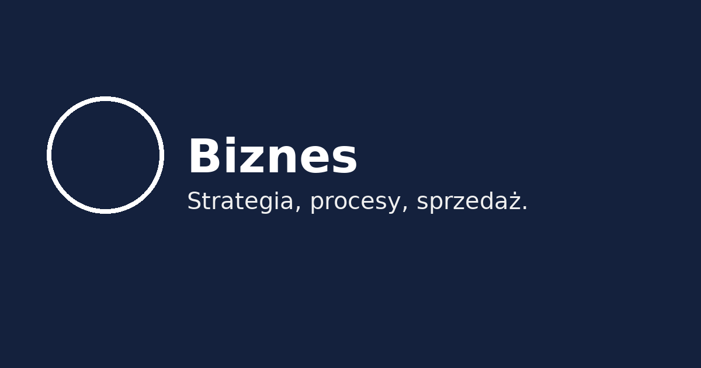

<section class="hero">
<h1>Kategorie</h1>
Najczęściej poruszane tematy.

</section>

  <section class="posts">
    <article class="post" id="biznes">

Temat
<h2 class="post__title">Biznes</h2>
Strategia, procesy, sprzedaż.

</article>
    <article class="post" id="psychologia">

Temat
<h2 class="post__title">Psychologia</h2>
Nawyki, energia, odporność.

</article>
    <article class="post" id="technologia">

Temat
<h2 class="post__title">Technologia</h2>
IT, automatyzacje, AI.

</article>
  </section>
  <aside class="sidebar"><section class="card"><h3>Tagi</h3><nav class="tags"><a class="tag" href="#biznes">#biznes</a><a class="tag" href="#psychologia">#rezyliencja</a><a class="tag" href="#technologia">#narzędzia</a></nav></section></aside>

